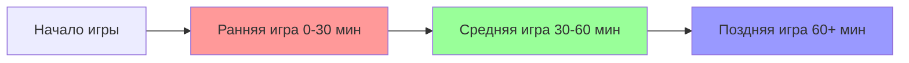
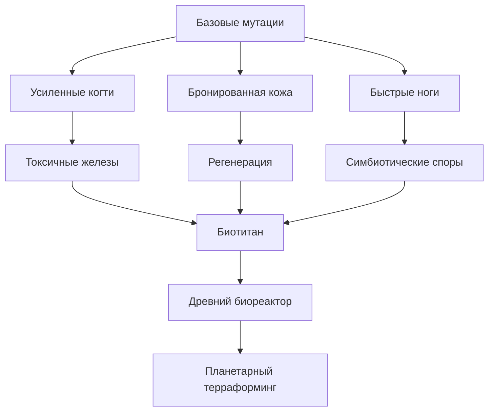
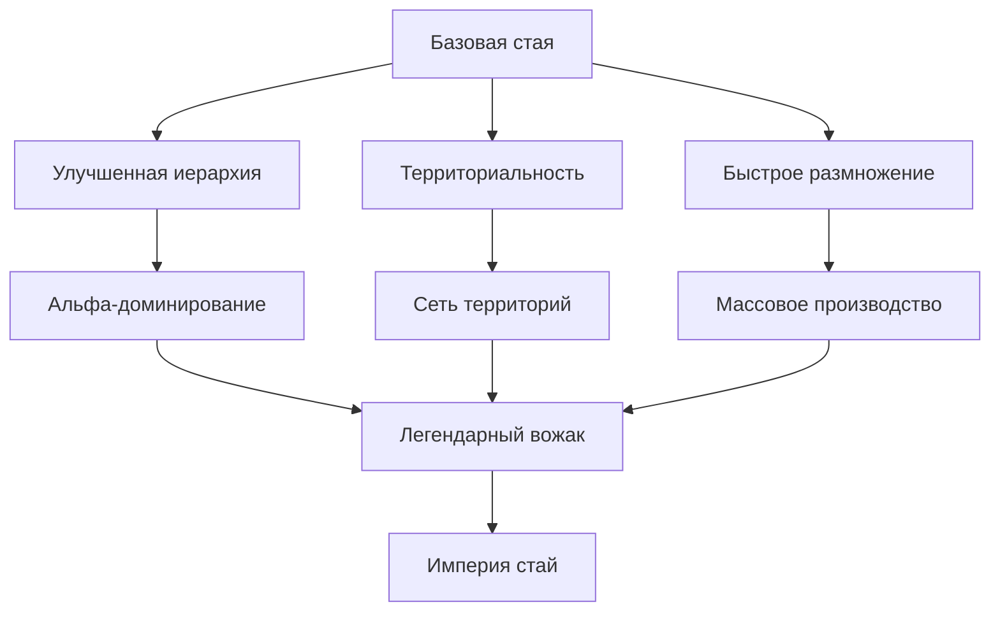
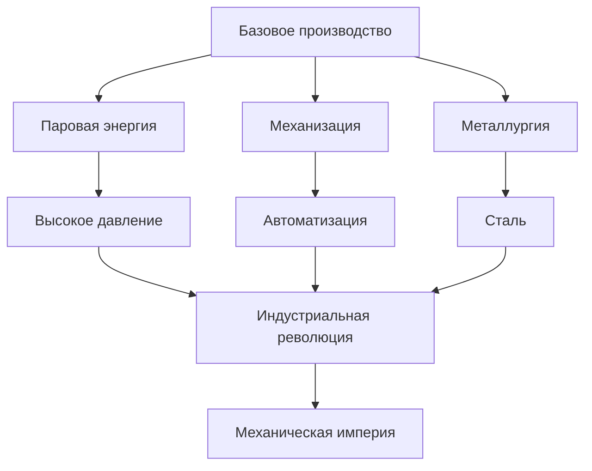

# Баланс и прогрессия: Три Расы
## Система балансировки и развития игры

**Версия:** 1.0  
**Дата:** 01.12.2024

---

## 1. Философия баланса

### 1.1 Принципы балансировки

**Асимметричный баланс:**
Три расы радикально отличаются друг от друга, но сбалансированы через разные сильные и слабые стороны.

**Ключевые принципы:**
- 🎯 Каждая раса имеет уникальную нишу
- ⚖️ Нет "лучшей" расы - только разные стили игры
- 🔄 Контр-механики между расами
- 📈 Разные кривые силы (ранняя/средняя/поздняя игра)

---

### 1.2 Кривые силы рас



**Песиголовцы:**
- Ранняя игра: ⭐⭐⭐⭐⭐ (Очень сильны)
- Средняя игра: ⭐⭐⭐ (Средне)
- Поздняя игра: ⭐⭐ (Слабеют)

**Русы:**
- Ранняя игра: ⭐⭐ (Слабы)
- Средняя игра: ⭐⭐⭐⭐ (Сильны)
- Поздняя игра: ⭐⭐⭐⭐ (Очень сильны)

**Ящеры:**
- Ранняя игра: ⭐⭐ (Слабы)
- Средняя игра: ⭐⭐⭐ (Средне)
- Поздняя игра: ⭐⭐⭐⭐⭐ (Доминируют)

---

## 2. Сравнительная таблица рас

### 2.1 Базовые характеристики

| Параметр | Ящеры | Песиголовцы | Русы |
|----------|-------|-------------|------|
| **Скорость роста** | Медленная | Очень быстрая | Средняя |
| **Стоимость юнита** | Высокая | Низкая | Средняя |
| **Время создания юнита** | 2 мин | 1 мин | 1.5 мин |
| **Продолжительность жизни** | Бесконечная | 15-30 мин | Бесконечная |
| **Максимум юнитов** | 50 | 80 | 60 |
| **Сила юнита (базовая)** | 8/10 | 5/10 | 6/10 |
| **Скорость юнита** | 80 | 120 | 100 |
| **HP юнита** | 120 | 80 | 100 |

### 2.2 Экономика

| Параметр | Ящеры | Песиголовцы | Русы |
|----------|-------|-------------|------|
| **Скорость добычи** | Средняя | Быстрая | Медленная (но автоматизируется) |
| **Эффективность** | Высокая | Низкая | Очень высокая |
| **Зависимость от ресурсов** | Биомасса | Мясо | Уголь, Железо |
| **Сложность экономики** | Средняя | Простая | Сложная |
| **Автоматизация** | Частичная | Нет | Полная |

### 2.3 Военная мощь

| Параметр | Ящеры | Песиголовцы | Русы |
|----------|-------|-------------|------|
| **Ранняя игра** | 4/10 | 9/10 | 3/10 |
| **Средняя игра** | 6/10 | 7/10 | 8/10 |
| **Поздняя игра** | 10/10 | 5/10 | 9/10 |
| **Стиль боя** | Танки + Мутанты | Рой + Скорость | Дальний бой + Механизмы |
| **Оборона** | Отлично | Средне | Отлично |
| **Мобильность** | Низкая | Очень высокая | Средняя |

---

## 3. Детальный баланс юнитов

### 3.1 Базовые рабочие юниты

| Характеристика | Ящер-рабочий | Песиголовец-омега | Рус-рабочий |
|----------------|--------------|-------------------|-------------|
| **HP** | 120 | 80 | 100 |
| **Урон** | 8 | 6 | 7 |
| **Броня** | 3 | 1 | 2 |
| **Скорость** | 80 | 120 | 100 |
| **Скорость добычи** | 1.0x | 1.2x | 0.8x |
| **Скорость строительства** | 0.8x | 1.0x | 1.2x |
| **Стоимость** | 50 биомассы | 30 мяса | 40 дерева + 10 железа |
| **Время создания** | 120 сек | 60 сек | 90 сек |

### 3.2 Боевые юниты (базовые)

| Характеристика | Ящер-воин | Песиголовец-бета | Рус-стрелок |
|----------------|-----------|------------------|-------------|
| **HP** | 180 | 120 | 140 |
| **Урон** | 15 | 12 | 10 (дальний) |
| **Броня** | 5 | 2 | 3 |
| **Скорость** | 70 | 140 | 90 |
| **Дальность** | Ближний | Ближний | 15 тайлов |
| **Особенность** | Регенерация | Стайные бонусы | Залповый огонь |
| **Стоимость** | 80 биомассы + 20 хитина | 50 мяса + 20 костей | 60 дерева + 30 железа |
| **Время создания** | 150 сек | 90 сек | 120 сек |

### 3.3 Элитные юниты

| Характеристика | Биотитан | Альфа-вожак | Паровой голем |
|----------------|----------|-------------|---------------|
| **HP** | 500 | 250 | 400 |
| **Урон** | 40 | 30 | 35 |
| **Броня** | 10 | 5 | 15 |
| **Скорость** | 60 | 150 | 50 |
| **Особенность** | Споровое облако | Баффы стае | Неуязвим к яду |
| **Стоимость** | 5 юнитов (слияние) | Повышение из Беты | 200 железа + 100 угля |
| **Время создания** | Мгновенно | Через дуэль | 300 сек |
| **Ограничение** | Временный (5 мин) | 1 на стаю | Макс 3 |

---

## 4. Баланс построек

### 4.1 Базовые постройки

| Постройка | Раса | HP | Стоимость | Время | Функция |
|-----------|------|----|-----------|----|---------|
| Биореактор | Ящеры | 500 | 100 биомассы | 180 сек | Центр колонии |
| Логово | Песиголовцы | 300 | 50 дерева + 30 шкур | 90 сек | Размножение |
| Ратуша | Русы | 400 | 100 дерева + 50 камня | 120 сек | Центр колонии |

### 4.2 Производственные постройки

| Постройка | Раса | Производство | Стоимость | Рабочих |
|-----------|------|--------------|-----------|---------|
| Биоферма | Ящеры | 10 биомассы/мин | 50 биомассы | 1 |
| Мясная яма | Песиголовцы | Хранение 500 | 40 дерева + 20 костей | 0 |
| Лесопилка | Русы | 15 досок/мин | 60 дерева | 2 |

### 4.3 Оборонительные постройки

| Постройка | Раса | HP | Урон | Дальность | Стоимость |
|-----------|------|----|------|-----------|-----------|
| Споровая пушка | Ящеры | 200 | 15 (яд) | 20 | 100 биомассы + 50 хитина |
| Сторожевая вышка | Песиголовцы | 150 | 10 | 25 | 80 дерева + 40 костей |
| Паровая турель | Русы | 250 | 20 | 30 | 100 железа + 50 угля |

---

## 5. Система прогрессии

### 5.1 Дерево технологий

#### Ящеры - Биологическая эволюция



**Уровни исследований:**

**Уровень 1 (0-15 минут):**
- Базовые мутации
- Споровое размножение
- Биомассовые фермы

**Уровень 2 (15-30 минут):**
- Продвинутые мутации
- Симбиотическое слияние
- Нектарные ульи
- Хитиновая броня

**Уровень 3 (30-60 минут):**
- Биотитаны
- Терраформинг
- Споровые облака
- Регенеративные поля

**Уровень 4 (60+ минут):**
- Древний биореактор
- Планетарный терраформинг
- Эволюционный скачок
- Биологическое доминирование

---

#### Песиголовцы - Стайная тактика



**Уровень 1 (0-15 минут):**
- Формирование стай
- Базовая иерархия
- Территориальные метки
- Логова

**Уровень 2 (15-30 минут):**
- Система Альф
- Улучшенные метки
- Костяное оружие
- Кожаная броня

**Уровень 3 (30-60 минут):**
- Боевой вой
- Сеть территорий
- Массовое размножение
- Элитные воины

**Уровень 4 (60+ минут):**
- Легендарные Альфы
- Империя стай
- Тотальное доминирование
- Бесконечная орда

---

#### Русы - Индустриализация



**Уровень 1 (0-15 минут):**
- Базовые инструменты
- Простые механизмы
- Деревянные постройки
- Ручной труд

**Уровень 2 (15-30 минут):**
- Паровые котлы
- Конвейерные ленты
- Железные инструменты
- Коллективный труд

**Уровень 3 (30-60 минут):**
- Автоматизация
- Высокое давление
- Сталь
- Паровые големы

**Уровень 4 (60+ минут):**
- Полная автоматизация
- Механическая армия
- Индустриальное доминирование
- Фабрика-город

---

## 6. Экономический баланс

### 6.1 Стоимость ресурсов (относительная)

| Ресурс | Базовая ценность | Скорость добычи | Применение |
|--------|------------------|-----------------|------------|
| **Дерево** | 1 | Быстро | Универсальное |
| **Камень** | 1 | Средне | Постройки |
| **Железо** | 3 | Медленно | Инструменты, оружие |
| **Уголь** | 2 | Средне | Топливо |
| **Биомасса** | 2 | Средне | Ящеры: всё |
| **Мясо** | 2 | Быстро (охота) | Песиголовцы: еда |
| **Нектар** | 5 | Медленно | Ящеры: эволюция |
| **Хитин** | 4 | Медленно | Ящеры: броня |

### 6.2 Производственные цепочки

#### Ящеры
```
Биомасса (базовый) → Нектар (×5 ценность) → Мутации
                   → Хитин (×4 ценность) → Броня
                   → Споры (×3 ценность) → Юниты
```

#### Песиголовцы
```
Охота → Мясо (еда) → Размножение
      → Кости (×2) → Оружие
      → Шкуры (×2) → Броня
```

#### Русы
```
Дерево → Доски (×1.5) → Постройки
       → Уголь (×2) → Пар → Энергия
Железо → Инструменты (×3) → Производство
       → Оружие (×4) → Армия
       → Механизмы (×5) → Автоматизация
```

---

## 7. Баланс сложности

### 7.1 Кривая обучения

| Раса | Сложность | Время освоения | Потолок мастерства |
|------|-----------|----------------|-------------------|
| **Песиголовцы** | ⭐⭐ Легко | 1-2 часа | Средний |
| **Русы** | ⭐⭐⭐ Средне | 3-5 часов | Высокий |
| **Ящеры** | ⭐⭐⭐⭐ Сложно | 5-10 часов | Очень высокий |

### 7.2 Рекомендации для новичков

**Начните с Песиголовцев:**
- Простая экономика (охота)
- Быстрое размножение
- Интуитивная стайная механика
- Агрессивный стиль игры

**Затем попробуйте Русов:**
- Более сложная экономика
- Требует планирования
- Автоматизация упрощает поздную игру
- Сбалансированный стиль

**Освойте Ящеров последними:**
- Самая сложная раса
- Требует понимания всех механик
- Медленный старт
- Огромный потенциал в поздней игре

---

## 8. Контр-механики между расами

### 8.1 Матрица преимуществ

| Атакующий ↓ / Защищающийся → | Ящеры | Песиголовцы | Русы |
|------------------------------|-------|-------------|------|
| **Ящеры** | 50% | 60% | 40% |
| **Песиголовцы** | 40% | 50% | 70% |
| **Русы** | 60% | 30% | 50% |

**Интерпретация:**
- Песиголовцы сильны против Русов (ранние рейды)
- Русы сильны против Ящеров (дальний бой, механизмы)
- Ящеры сильны против Песиголовцев (танки, яд)

### 8.2 Стратегические контры

**Ящеры vs Песиголовцы:**
- ✅ Преимущество: Высокий HP, регенерация, яд
- ✅ Тактика: Оборона, терраформинг (болота замедляют)
- ❌ Слабость: Медленные, уязвимы к ранним рейдам

**Песиголовцы vs Русы:**
- ✅ Преимущество: Скорость, численность, ранние рейды
- ✅ Тактика: Атаковать до автоматизации
- ❌ Слабость: Слабы против турелей и механизмов

**Русы vs Ящеры:**
- ✅ Преимущество: Дальний бой, механизмы, огонь
- ✅ Тактика: Держать дистанцию, использовать турели
- ❌ Слабость: Медленная экономика, уязвимы к рейдам

---

## 9. Система сложности

### 9.1 Настройки сложности

#### Легкая сложность
**Модификаторы:**
- Ресурсы: ×1.5
- Скорость производства: ×1.3
- Урон врагов: ×0.7
- Частота событий: ×0.5
- Стартовые ресурсы: ×2

**Рекомендуется для:**
- Новичков
- Изучения механик
- Расслабленной игры

#### Нормальная сложность
**Модификаторы:**
- Ресурсы: ×1.0
- Скорость производства: ×1.0
- Урон врагов: ×1.0
- Частота событий: ×1.0
- Стартовые ресурсы: ×1

**Рекомендуется для:**
- Опытных игроков
- Сбалансированного опыта
- Первого прохождения

#### Сложная сложность
**Модификаторы:**
- Ресурсы: ×0.7
- Скорость производства: ×0.8
- Урон врагов: ×1.3
- Частота событий: ×1.5
- Стартовые ресурсы: ×0.5

**Рекомендуется для:**
- Ветеранов
- Челленджа
- Достижений

#### Экстремальная сложность
**Модификаторы:**
- Ресурсы: ×0.5
- Скорость производства: ×0.6
- Урон врагов: ×2.0
- Частота событий: ×2.0
- Стартовые ресурсы: ×0.3

**Особенности:**
- Постоянные угрозы
- Критическая нехватка ресурсов
- Требует идеального планирования
- Для хардкорных игроков

---

## 10. Метрики баланса

### 10.1 Целевые показатели

**Время до первой постройки:**
- Ящеры: 30 секунд
- Песиголовцы: 20 секунд
- Русы: 25 секунд

**Время до 10 юнитов:**
- Ящеры: 15 минут
- Песиголовцы: 8 минут
- Русы: 12 минут

**Время до стабильной экономики:**
- Ящеры: 25 минут
- Песиголовцы: 15 минут
- Русы: 20 минут

**Время до первой атаки (AI):**
- Легко: 30 минут
- Нормально: 20 минут
- Сложно: 15 минут
- Экстремально: 10 минут

### 10.2 Показатели победы

**Критерии успешной колонии:**
- 30+ юнитов
- Стабильная экономика (положительный баланс ресурсов)
- Оборонительные структуры
- Исследования 2+ уровня
- Отбито 3+ атаки

**Время до доминирования:**
- Песиголовцы: 40-50 минут
- Русы: 60-70 минут
- Ящеры: 80-90 минут

---

## 11. Система балансировки

### 11.1 Методология тестирования

**Этапы балансировки:**

1. **Альфа-тестирование (внутреннее)**
   - Базовые механики
   - Грубый баланс
   - Выявление критических проблем

2. **Бета-тестирование (закрытое)**
   - Тонкая настройка
   - Сбор статистики
   - Фокус-группы

3. **Открытое тестирование**
   - Массовый сбор данных
   - Анализ винрейтов
   - Корректировки на основе метрик

4. **Пост-релиз**
   - Мониторинг метрик
   - Регулярные патчи
   - Сезонные изменения

### 11.2 Ключевые метрики для мониторинга

**Винрейт рас:**
- Целевой: 48-52% для каждой расы
- Критический: <45% или >55%

**Популярность рас:**
- Целевой: 30-35% для каждой
- Критический: <20% или >45%

**Средняя длительность игры:**
- Целевой: 45-60 минут
- Критический: <30 или >90 минут

**Процент завершенных игр:**
- Целевой: >80%
- Критический: <70%

---

## 12. Рекомендации по балансировке

### 12.1 Частые проблемы и решения

**Проблема: Одна раса доминирует**
- Решение: Усилить контр-механики
- Пример: Если Песиголовцы слишком сильны → усилить оборону Русов

**Проблема: Слишком быстрые/медленные игры**
- Решение: Корректировка скорости производства
- Пример: Если игры слишком быстрые → увеличить стоимость юнитов

**Проблема: Низкая реиграбельность**
- Решение: Добавить вариативность
- Пример: Больше случайных событий, альтернативные стратегии

### 12.2 Инструменты балансировки

**Конфигурационные файлы:**
```json
{
  "lizard_worker": {
    "health": 120,
    "damage": 8,
    "speed": 80,
    "cost": {"biomass": 50},
    "build_time": 120
  }
}
```

**Преимущества:**
- Легко изменять без перекомпиляции
- Можно A/B тестировать
- Быстрые хотфиксы

**Система модификаторов:**
```gdscript
# Глобальные модификаторы для балансировки
var balance_modifiers = {
    "lizards": {
        "damage": 1.0,
        "health": 1.0,
        "speed": 1.0
    },
    "canids": {
        "damage": 1.1,  # +10% урона для балансировки
        "health": 0.9,  # -10% HP
        "speed": 1.0
    }
}
```

---

## 13. Заключение

Баланс игры - это постоянный итеративный процесс. Три расы должны оставаться уникальными и интересными, при этом ни одна не должна доминировать.

**Ключевые принципы:**
- 🎯 Асимметричный, но справедливый баланс
- 📊 Решения на основе данных
- 🔄 Регулярные обновления
- 👥 Обратная связь от сообщества

**Следующие шаги:**
1. Реализовать базовый баланс
2. Провести внутреннее тестирование
3. Собрать метрики
4. Итеративно улучшать
5. Запустить бета-тестирование