# Диаграммы потока данных FunRTS

**Версия:** 1.0  
**Дата:** 04.12.2024

---

## 0. ECS Архитектура (Новое!)

### 0.1 Общая схема ECS

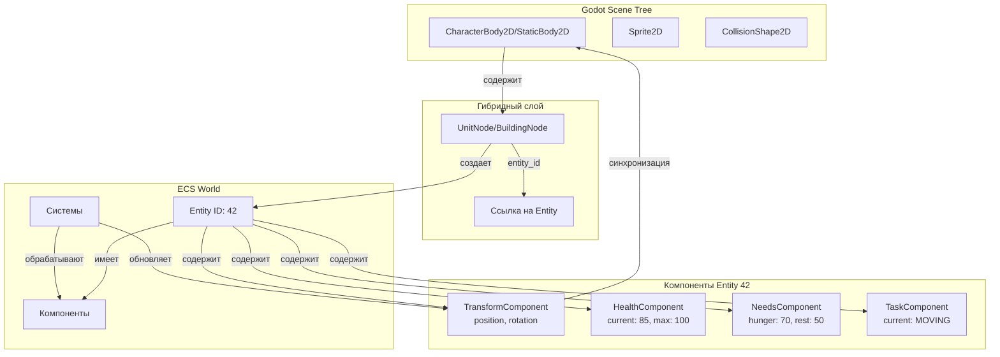

### 0.2 Поток данных в ECS

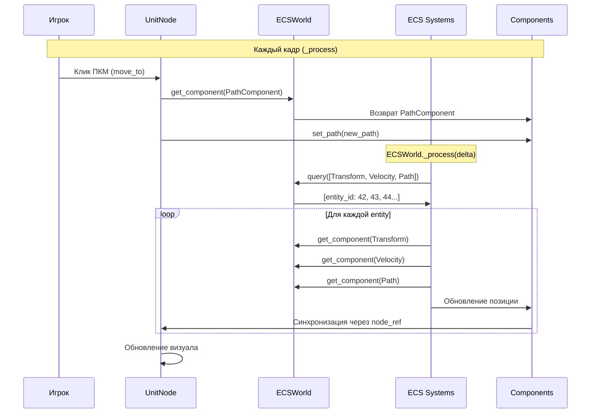

### 0.3 Сравнение: OOP vs ECS

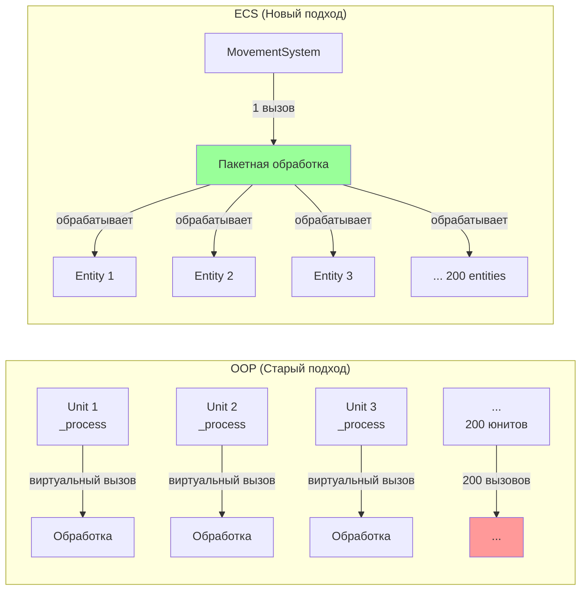

---

## 1. Общая архитектура системы

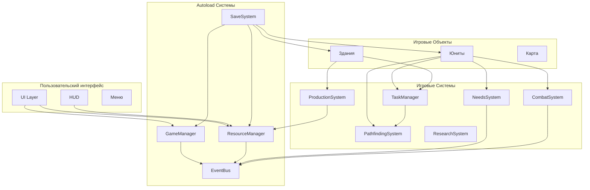

---

## 2. Поток данных: Жизненный цикл юнита

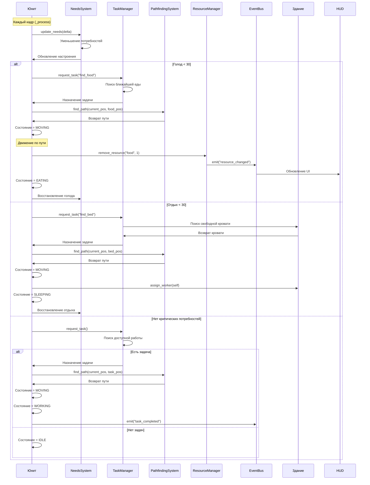

---

## 3. Поток данных: Строительство здания

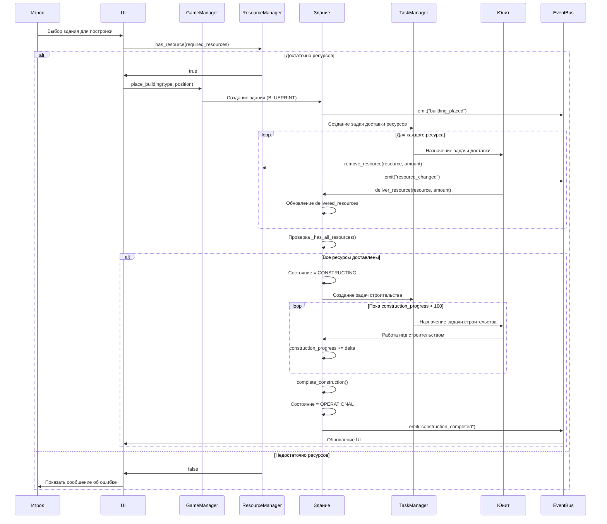

---

## 4. Поток данных: Производственная цепочка

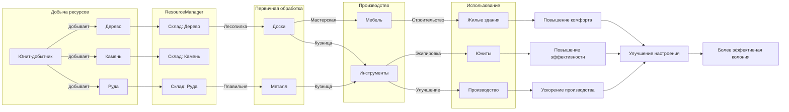

---

## 5. Поток данных: Боевая система

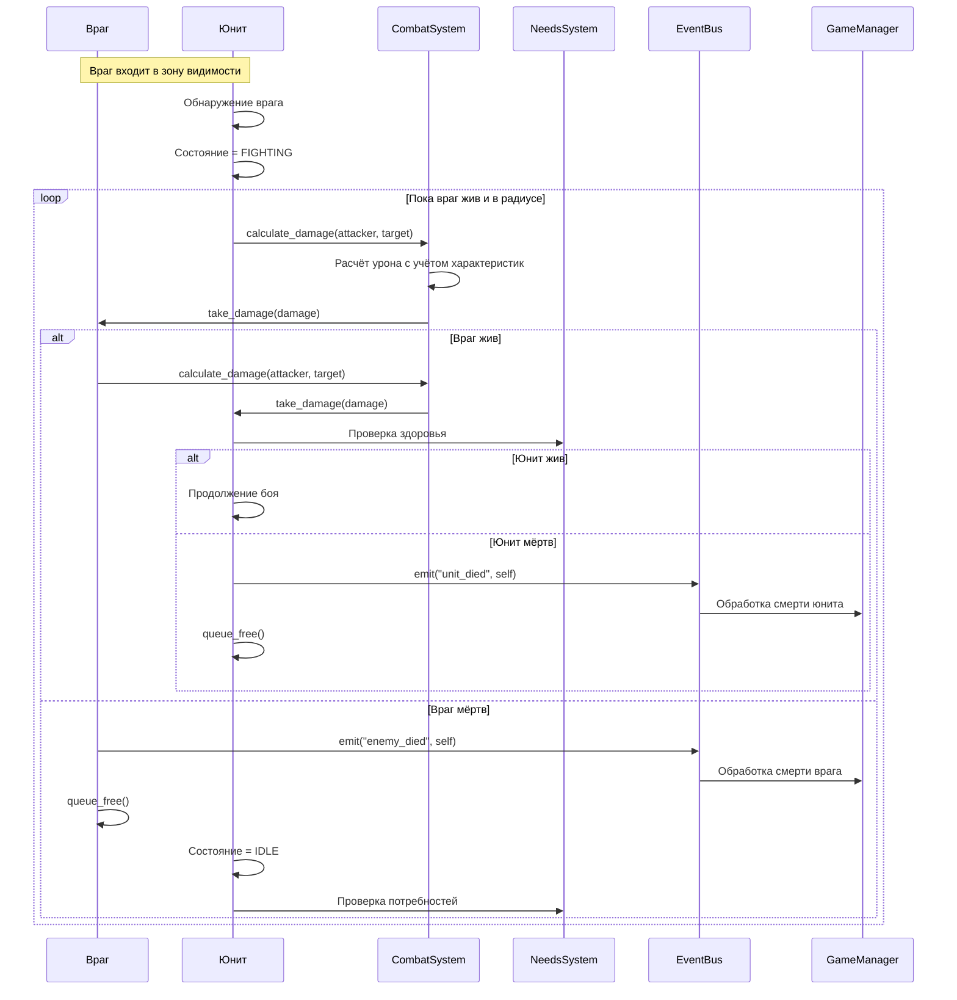

---

## 6. Поток данных: Система событий (EventBus)

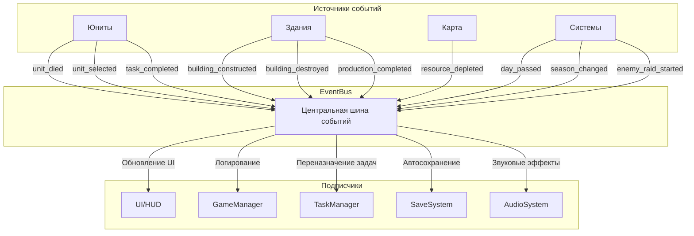

---

## 7. Поток данных: Система сохранения

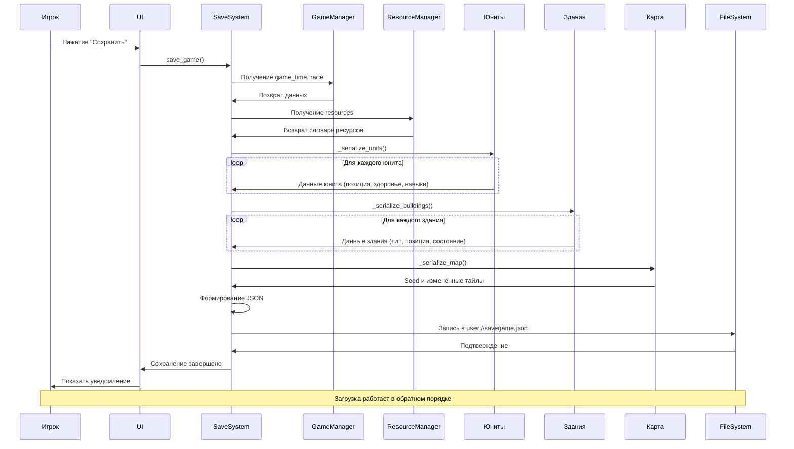

---

## 8. Поток данных: Система потребностей

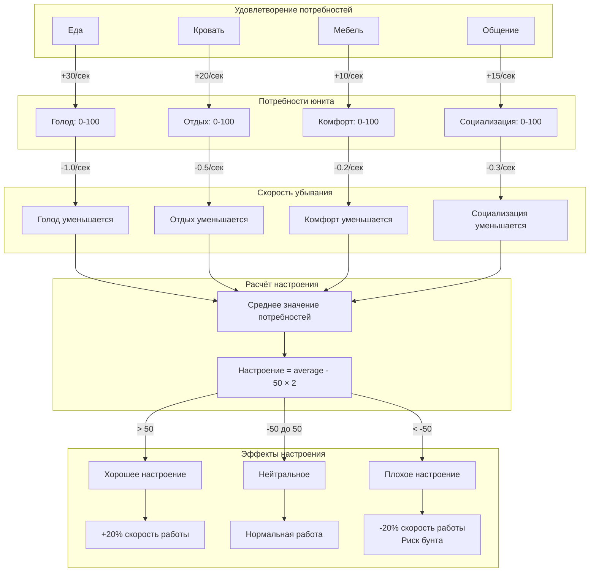

---

## 9. Поток данных: Поиск пути (A*)

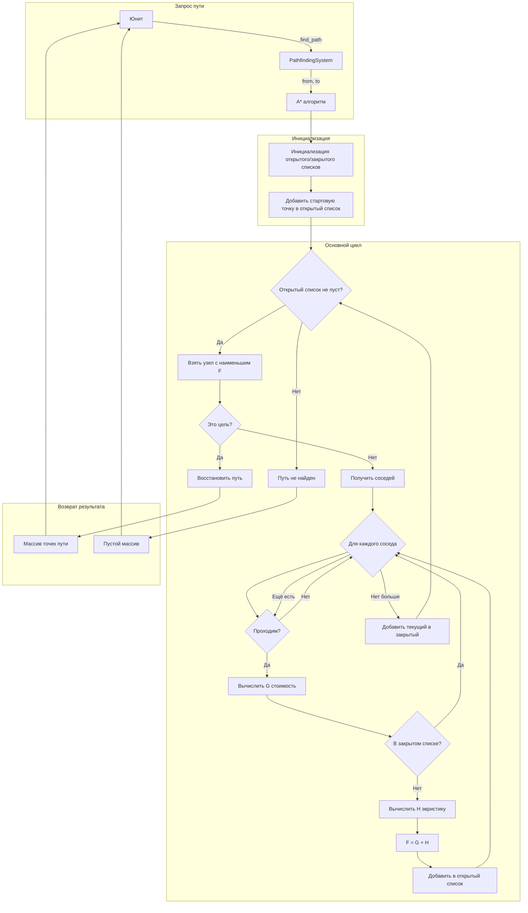

---

## 10. Поток данных: Расовые особенности

### 10.1 Ящеры - Биологическая система

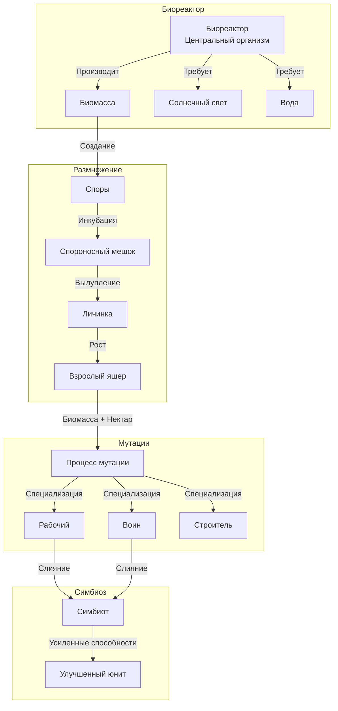

### 10.2 Песиголовцы - Стайная система

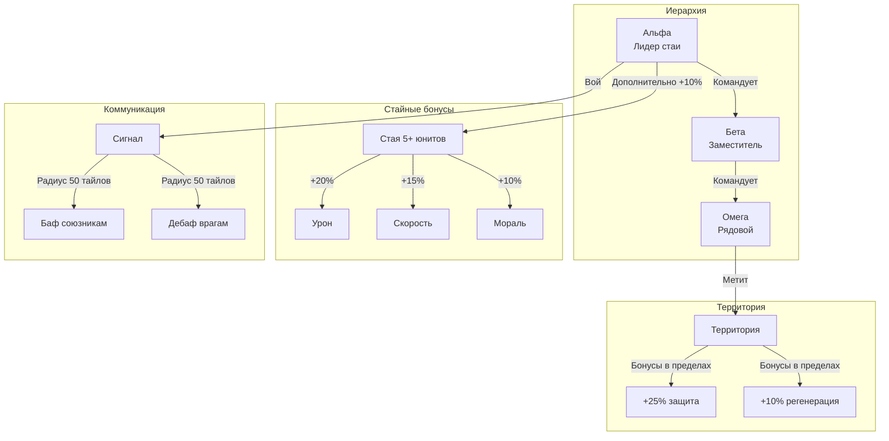

### 10.3 Русы - Технологическая система

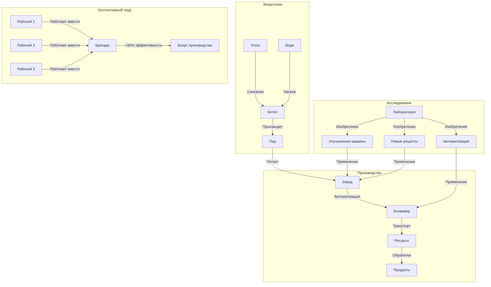

---

## 11. Оптимизация: Система чанков

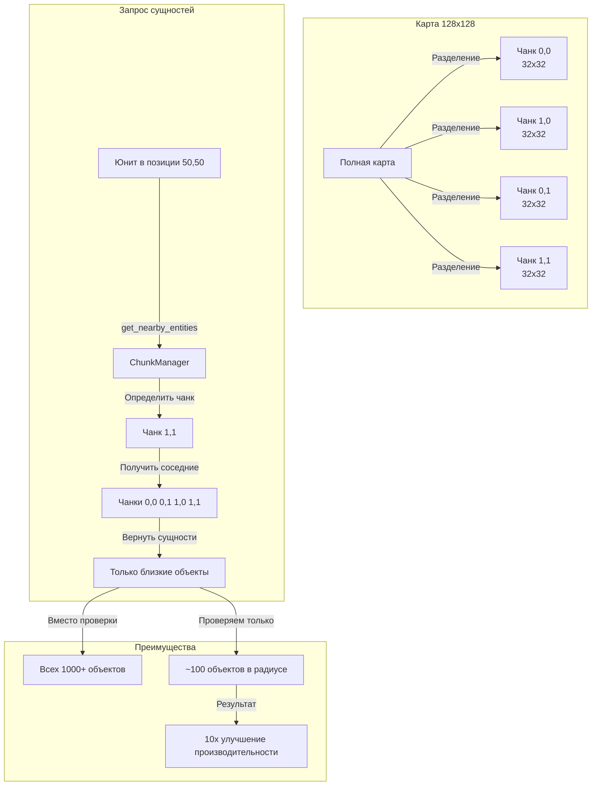

---

## Заключение

Эти диаграммы показывают основные потоки данных в игре FunRTS. Архитектура построена на принципах:

1. **Модульность** — системы слабо связаны через EventBus
2. **Эффективность** — оптимизация через чанки и пулы объектов
3. **Расширяемость** — легко добавлять новые расы и механики
4. **Читаемость** — чёткое разделение ответственности

Каждая система имеет определённую роль и взаимодействует с другими через чётко определённые интерфейсы.