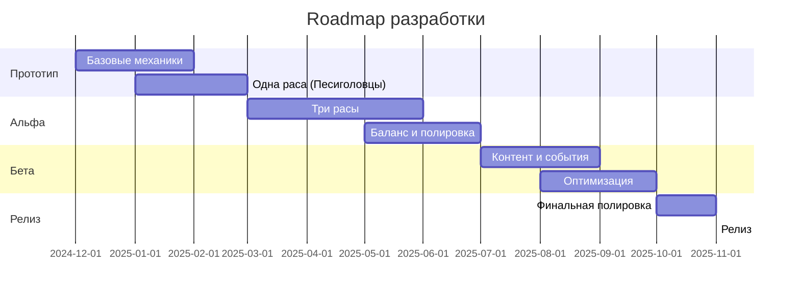

# Roadmap разработки: Три Расы
## План поэтапной разработки игры

**Версия:** 2.0
**Дата:** 14.12.2024
**Обновление:** Добавлена ECS архитектура
**Общая длительность:** 12-18 месяцев

---

## 1. Обзор разработки

### 1.1 Философия разработки

**Итеративный подход:**
- Разработка по спиралям (прототип → тестирование → улучшение)
- Вертикальные срезы (полная функциональность одной расы, затем другие)
- Постоянное тестирование и сбор обратной связи

**Приоритеты:**
1. 🎮 **Геймплей** - механики должны быть интересными
2. 🎨 **Визуал** - читаемый и приятный интерфейс
3. 🔧 **Производительность** - стабильные 60 FPS
4. 🐛 **Стабильность** - минимум багов

---

### 1.2 Этапы разработки

---

## 2. Фаза 0: Подготовка (2 недели)

### 2.1 Настройка окружения

**Задачи:**
- ✅ Установить Godot 4.x
- ✅ Настроить Git репозиторий
- ✅ Создать структуру проекта
- ✅ Настроить систему контроля версий
- ✅ Подготовить инструменты для графики (Aseprite)

**Результат:**
- Готовое окружение для разработки
- Базовая структура проекта
- Документация по настройке

---

## 3. Фаза 1: Прототип (3 месяца)

### 3.0 Месяц 0.5: ECS Инфраструктура (НОВОЕ!)

**Неделя 1-2: Базовая ECS**
- [x] Создать ECSWorld, Entity, Component, System
- [x] Создать EntityNode для связи Node ↔ ECS
- [x] Настроить автозагрузку ECSWorld
- [x] Создать базовые компоненты (Transform, Health, Velocity)

**Неделя 3-4: ECS Системы и компоненты**
- [x] Создать все необходимые компоненты (15 шт)
- [x] Создать базовые системы (Needs, Movement, Production, AI)
- [x] Создать UnitNode и BuildingNode
- [ ] Протестировать ECS с тестовыми сценами

**Результат:**
- ✅ Полная ECS инфраструктура готова
- ✅ Гибридный подход реализован
- 🚧 Готово к миграции существующих юнитов

### 3.1 Месяц 1: Базовые механики

**Неделя 1-2: Карта и навигация**
- [x] Система тайлов
- [x] Процедурная генерация карты
- [x] Камера (перемещение, зум)
- [x] Базовый рендеринг

**Неделя 3-4: Юниты**
- [x] Базовый класс Unit
- [x] Движение юнитов
- [x] Pathfinding (A*)
- [x] Выделение и управление
- [ ] Миграция на UnitNode (ECS)

**Результат:**
- Можно создать карту
- Юниты могут двигаться по карте
- Работает выделение и управление

---

### 3.2 Месяц 2: Базовая экономика

**Неделя 5-6: Ресурсы**
- [ ] Система ресурсов
- [ ] ResourceManager
- [ ] Добыча ресурсов
- [ ] Хранение ресурсов

**Неделя 7-8: Строительство**
- [ ] Базовый класс Building
- [ ] Размещение построек
- [ ] Строительство (прогресс)
- [ ] Простые постройки (склад, жилье)

**Результат:**
- Работает добыча ресурсов
- Можно строить базовые постройки
- Ресурсы хранятся и отображаются

---

### 3.3 Месяц 3: Первая раса (Песиголовцы)

**Неделя 9-10: Стайная механика**
- [ ] Система стай
- [ ] Стайные бонусы
- [ ] Автоматическое формирование стай
- [ ] UI для стай

**Неделя 11-12: Базовые постройки**
- [ ] Логово (размножение)
- [ ] Мясная яма
- [ ] Костяная мастерская
- [ ] Сторожевая вышка

**Результат:**
- Песиголовцы полностью играбельны
- Работают все базовые механики
- Можно построить небольшую колонию

**Milestone: Вертикальный срез готов**
- Демо с одной расой
- Все основные системы работают
- Можно играть 30+ минут

---

## 4. Фаза 2: Альфа (4 месяца)

### 4.1 Месяц 4: Вторая раса (Русы)

**Неделя 13-14: Паровая система**
- [ ] Паровые котлы
- [ ] Система труб
- [ ] Распределение пара
- [ ] UI для паровой системы

**Неделя 15-16: Производственные цепочки**
- [ ] Конвейерные ленты
- [ ] Автоматические манипуляторы
- [ ] Производственные постройки
- [ ] Система крафтинга

**Результат:**
- Русы играбельны
- Работает паровая система
- Можно создавать производственные цепочки

---

### 4.2 Месяц 5: Третья раса (Ящеры)

**Неделя 17-18: Биологическая система**
- [ ] Биореактор
- [ ] Споровое размножение
- [ ] Биоэнергия
- [ ] Органические постройки

**Неделя 19-20: Система мутаций**
- [ ] Камера мутаций
- [ ] Базовые мутации
- [ ] Симбиотическое слияние
- [ ] UI для мутаций

**Результат:**
- Ящеры играбельны
- Работают все уникальные механики
- Три расы доступны для игры

**Milestone: Все расы готовы**
- Три играбельные расы
- Уникальные механики работают
- Базовый баланс

---

### 4.3 Месяц 6-7: Баланс и полировка

**Неделя 21-24: Первая волна баланса**
- [ ] Сбор статистики
- [ ] Анализ винрейтов
- [ ] Корректировка характеристик
- [ ] Тестирование баланса

**Неделя 25-28: Системы жизнеобеспечения**
- [ ] Система потребностей (голод, отдых)
- [ ] Система настроения
- [ ] Социальные взаимодействия
- [ ] Последствия низкого настроения

**Результат:**
- Базовый баланс между расами
- Работают системы потребностей
- Юниты ведут себя реалистично

**Milestone: Альфа-версия**
- Все основные механики реализованы
- Три сбалансированные расы
- Можно играть 60+ минут
- Готово для закрытого тестирования

---

## 5. Фаза 3: Бета (3 месяца)

### 5.1 Месяц 8: Контент и события

**Неделя 29-30: Случайные события**
- [ ] Система событий
- [ ] 20+ различных событий
- [ ] Позитивные события
- [ ] Негативные события
- [ ] Нейтральные события

**Неделя 31-32: Исследования**
- [ ] Дерево технологий для каждой расы
- [ ] Система исследований
- [ ] UI для исследований
- [ ] Балансировка исследований

**Результат:**
- Богатый контент событий
- Работает система исследований
- Увеличена реиграбельность

---

### 5.2 Месяц 9: Боевая система

**Неделя 33-34: Базовый бой**
- [ ] Система боя
- [ ] Различные типы юнитов
- [ ] Боевые способности
- [ ] Мораль и отступление

**Неделя 35-36: AI противников**
- [ ] Базовый AI
- [ ] Рейды врагов
- [ ] Различные типы врагов
- [ ] Эскалация сложности

**Результат:**
- Работает боевая система
- AI создает угрозы
- Оборона колонии важна

---

### 5.3 Месяц 10: Оптимизация и полировка

**Неделя 37-38: Производительность**
- [ ] Профилирование
- [ ] Оптимизация рендеринга
- [ ] Оптимизация pathfinding
- [ ] Object pooling
- [ ] Spatial partitioning

**Неделя 39-40: UI/UX**
- [ ] Полировка интерфейса
- [ ] Туториал
- [ ] Система подсказок
- [ ] Улучшение читаемости

**Результат:**
- Стабильные 60 FPS
- Интуитивный интерфейс
- Новички могут легко начать

**Milestone: Бета-версия**
- Полный контент
- Оптимизированная производительность
- Готово для открытого тестирования

---

## 6. Фаза 4: Релиз (2 месяца)

### 6.1 Месяц 11: Финальная полировка

**Неделя 41-42: Исправление багов**
- [ ] Исправление критических багов
- [ ] Исправление средних багов
- [ ] Тестирование стабильности
- [ ] Регрессионное тестирование

**Неделя 43-44: Контент и баланс**
- [ ] Финальная балансировка
- [ ] Дополнительный контент
- [ ] Достижения
- [ ] Статистика

**Результат:**
- Минимум критических багов
- Финальный баланс
- Полный контент

---

### 6.2 Месяц 12: Подготовка к релизу

**Неделя 45-46: Маркетинг**
- [ ] Трейлер
- [ ] Скриншоты
- [ ] Описание в Steam/Itch.io
- [ ] Пресс-кит

**Неделя 47-48: Релиз**
- [ ] Финальное тестирование
- [ ] Подготовка билдов
- [ ] Релиз на платформах
- [ ] Мониторинг отзывов

**Milestone: Релиз 1.0**
- Игра выпущена
- Доступна на платформах
- Начат сбор обратной связи

---

## 7. Пост-релиз (постоянно)

### 7.1 Поддержка и обновления

**Первый месяц после релиза:**
- Хотфиксы критических багов
- Балансировочные патчи
- Сбор обратной связи
- Анализ метрик

**Долгосрочная поддержка:**
- Регулярные патчи (раз в 2 недели)
- Балансировочные обновления
- Новый контент (события, постройки)
- Улучшения на основе отзывов

### 7.2 Потенциальные DLC/Обновления

**Обновление 1.1 (через 3 месяца):**
- Новые события
- Дополнительные постройки
- Улучшения UI
- Новые достижения

**Обновление 1.2 (через 6 месяцев):**
- Новый биом
- Дополнительные мутации/технологии
- Сценарии
- Улучшения AI

**DLC "Четвертая раса" (через 9-12 месяцев):**
- Новая играбельная раса
- Уникальные механики
- Новые постройки и юниты
- Расширение карты

---

## 8. Ресурсы и команда

### 8.1 Минимальная команда

**Соло-разработка:**
- 1 программист/дизайнер (вы)
- Время: 20-30 часов в неделю
- Длительность: 18 месяцев

**Рекомендуемая команда:**
- 1 программист (full-time)
- 1 художник (part-time или фриланс)
- 1 звукодизайнер (фриланс)
- Длительность: 12 месяцев

### 8.2 Бюджет (опционально)

**Минимальный бюджет (соло):**
- Лицензии ПО: $0 (Godot бесплатен)
- Ассеты: $200-500 (опционально)
- Маркетинг: $500-1000
- **Итого: $700-1500**

**Рекомендуемый бюджет:**
- Художник: $3000-5000
- Звукодизайнер: $1000-2000
- Ассеты: $500-1000
- Маркетинг: $2000-3000
- **Итого: $6500-11000**

---

## 9. Риски и митигация

### 9.1 Технические риски

| Риск | Вероятность | Влияние | Митигация |
|------|-------------|---------|-----------|
| Проблемы с производительностью | Средняя | Высокое | Ранняя оптимизация, профилирование |
| Сложность балансировки | Высокая | Среднее | Итеративное тестирование, метрики |
| Баги в Godot | Низкая | Среднее | Использовать стабильную версию |
| Потеря данных | Низкая | Критическое | Git, регулярные бэкапы |

### 9.2 Проектные риски

| Риск | Вероятность | Влияние | Митигация |
|------|-------------|---------|-----------|
| Выгорание | Средняя | Критическое | Регулярные перерывы, реалистичные цели |
| Расширение скоупа | Высокая | Высокое | Строгий контроль фич, MVP подход |
| Недостаток времени | Средняя | Высокое | Буферное время, приоритизация |
| Низкий интерес игроков | Средняя | Высокое | Ранние тесты, сообщество |

---

## 10. Метрики успеха

### 10.1 Разработка

**Технические метрики:**
- ✅ 60+ FPS на средних настройках
- ✅ < 30 секунд загрузка
- ✅ < 10 критических багов на релизе
- ✅ 200+ юнитов без просадок

**Контентные метрики:**
- ✅ 3 полностью играбельные расы
- ✅ 30+ типов построек
- ✅ 50+ случайных событий
- ✅ 20+ исследований на расу

### 10.2 Релиз

**Целевые показатели:**
- 1000+ загрузок в первый месяц
- 4.0+ рейтинг на Steam/Itch.io
- 70%+ положительных отзывов
- 2+ часа средняя сессия

**Оптимистичные показатели:**
- 5000+ загрузок в первый месяц
- 4.5+ рейтинг
- 85%+ положительных отзывов
- Окупаемость разработки

---

## 11. Контрольные точки (Milestones)

### Milestone 1: Прототип (Месяц 3)
**Критерии:**
- ✅ Одна играбельная раса
- ✅ Базовые механики работают
- ✅ Можно играть 30 минут
- ✅ Демо для тестирования

**Решение:** Продолжать или пивотить?

---

### Milestone 2: Альфа (Месяц 7)
**Критерии:**
- ✅ Три играбельные расы
- ✅ Все основные механики
- ✅ Базовый баланс
- ✅ Можно играть 60+ минут

**Решение:** Готовы к закрытому тестированию?

---

### Milestone 3: Бета (Месяц 10)
**Критерии:**
- ✅ Полный контент
- ✅ Оптимизация завершена
- ✅ UI/UX отполирован
- ✅ Минимум критических багов

**Решение:** Готовы к открытому тестированию?

---

### Milestone 4: Релиз (Месяц 12)
**Критерии:**
- ✅ Все баги исправлены
- ✅ Финальный баланс
- ✅ Маркетинговые материалы готовы
- ✅ Билды подготовлены

**Решение:** Релиз!

---

## 12. Инструменты и процессы

### 12.1 Разработка

**Основные инструменты:**
- Godot 4.x - движок
- Git - контроль версий
- GitHub/GitLab - хостинг кода
- Aseprite - спрайты
- Trello/Notion - управление задачами

**Процессы:**
- Ежедневные коммиты
- Еженедельные обзоры прогресса
- Ежемесячные milestone reviews
- Регулярное тестирование

### 12.2 Тестирование

**Типы тестирования:**
- Юнит-тесты (критические системы)
- Интеграционные тесты
- Плейтесты (внутренние)
- Альфа/бета тестирование (внешнее)

**Частота:**
- Автоматические тесты: при каждом коммите
- Плейтесты: еженедельно
- Внешнее тестирование: на milestone'ах

---

## 13. Коммуникация и маркетинг

### 13.1 Сообщество

**Платформы:**
- Discord сервер (для тестеров и фанатов)
- Twitter/X (обновления разработки)
- Reddit (r/gamedev, r/indiegames)
- YouTube (devlogs)

**Контент:**
- Еженедельные devlog'и
- Скриншоты и GIF'ы
- Демо-версии на ключевых milestone'ах
- Прямые эфиры разработки

### 13.2 Маркетинг перед релизом

**За 3 месяца:**
- Создать Steam/Itch.io страницу
- Начать devlog'и
- Собрать wishlist'ы

**За 1 месяц:**
- Трейлер
- Пресс-релиз
- Контакт с инди-журналистами
- Бета-тестирование

**Неделя релиза:**
- Финальный трейлер
- Обзоры от блогеров
- Активность в соцсетях
- Launch discount

---

## 14. Заключение

Этот roadmap - живой документ, который будет обновляться по мере разработки. Ключ к успеху - **итеративная разработка** и **постоянное тестирование**.

**Помните:**
- 🎯 Фокус на core gameplay
- 📊 Решения на основе данных
- 🔄 Итеративный подход
- 👥 Обратная связь от игроков
- 💪 Не сдавайтесь!

**Следующие шаги:**
1. Настроить окружение разработки
2. Создать базовую структуру проекта
3. Начать с прототипа (Фаза 1)
4. Регулярно обновлять roadmap

---

**Удачи в разработке! 🚀**