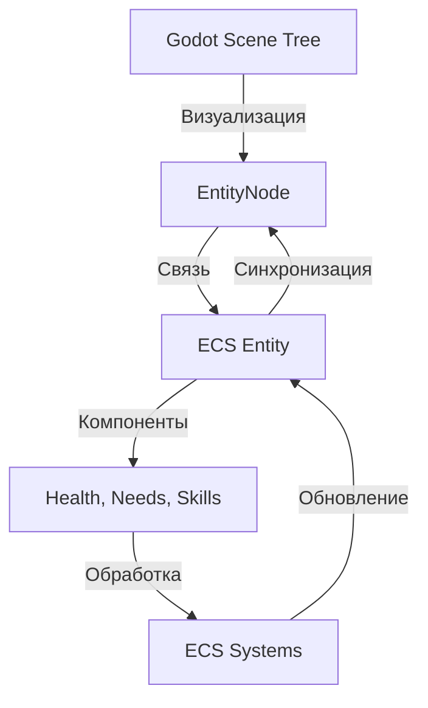
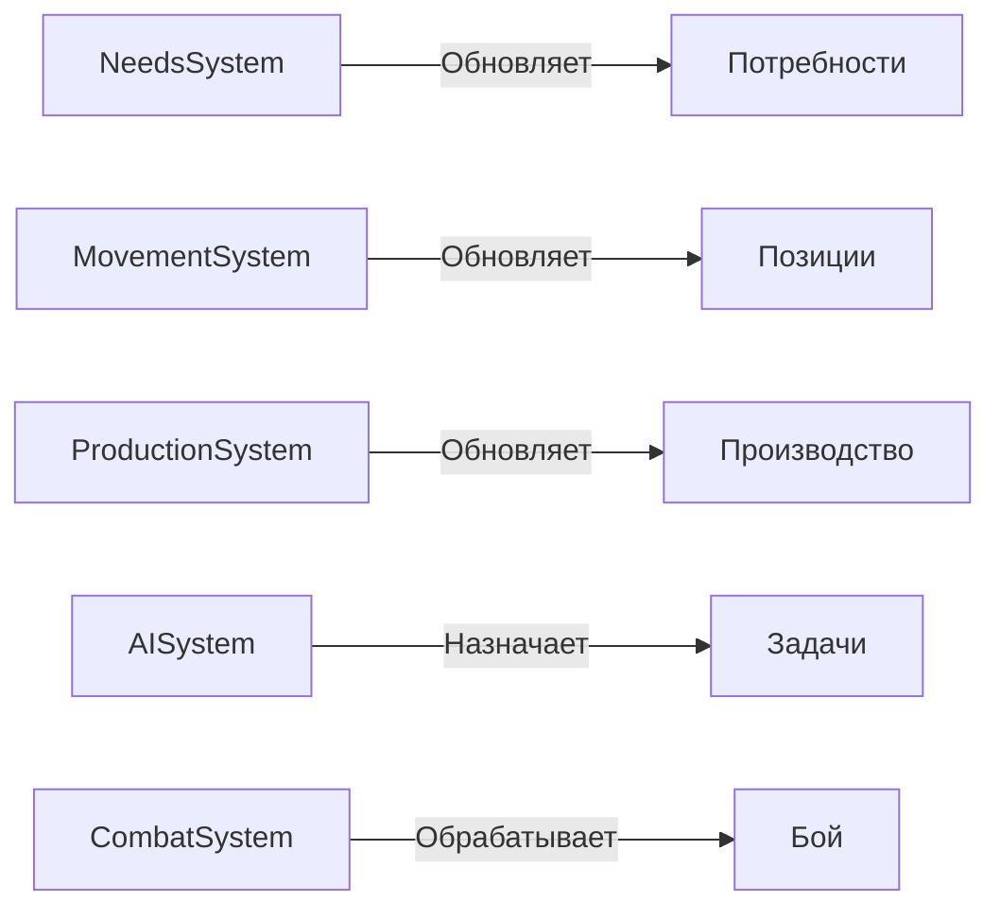

# План внедрения ECS
## Краткое руководство к действию

**Версия:** 1.0  
**Дата:** 14.12.2024  
**Приоритет:** Высокий

---

## 📋 Краткое резюме

### Рекомендуемый подход: **Гибридный ECS**

**Суть:** Godot Node для визуализации + ECS для логики симуляции

**Преимущества:**
- ✅ Сохраняем мощь Godot (физика, рендеринг, UI)
- ✅ Получаем производительность ECS (3-5x быстрее для 200+ юнитов)
- ✅ Постепенная миграция без риска
- ✅ Легко масштабируется

---

## 🎯 Ключевые решения

### 1. Архитектурная модель



### 2. Структура компонентов

**Базовые компоненты:**
- `TransformComponent` - позиция, поворот, масштаб
- `HealthComponent` - здоровье, регенерация
- `VelocityComponent` - скорость, ускорение

**Компоненты юнитов:**
- `NeedsComponent` - голод, отдых, комфорт, социализация
- `SkillsComponent` - навыки (добыча, строительство, бой)
- `TaskComponent` - текущая задача
- `PathComponent` - путь движения

**Компоненты зданий:**
- `BuildingComponent` - тип, состояние, прогресс
- `ProductionComponent` - очередь производства
- `WorkersComponent` - назначенные рабочие

**Расовые компоненты:**
- `LizardBioComponent` - биомасса, мутации
- `CanidPackComponent` - стая, иерархия
- `RusMechanicalComponent` - пар, автоматизация

### 3. Основные системы



---

## 📅 План внедрения (10-12 недель)

### Фаза 1: Инфраструктура (1-2 недели)
**Цель:** Создать базу ECS

**Задачи:**
- [ ] Создать `ECSWorld.gd` - менеджер ECS
- [ ] Создать `Entity.gd` - базовая сущность
- [ ] Создать `Component.gd` - базовый компонент
- [ ] Создать `System.gd` - базовая система
- [ ] Создать `EntityNode.gd` - связь Node ↔ ECS
- [ ] Настроить автозагрузку
- [ ] Написать unit-тесты

**Критерий успеха:** Можно создать entity с компонентами и обработать системой

---

### Фаза 2: Базовые компоненты (1 неделя)
**Цель:** Создать основные компоненты

**Задачи:**
- [ ] `TransformComponent` + тесты
- [ ] `HealthComponent` + тесты
- [ ] `VelocityComponent` + тесты
- [ ] `NeedsComponent` + тесты
- [ ] `SkillsComponent` + тесты
- [ ] `TaskComponent` + тесты
- [ ] `PathComponent` + тесты

**Критерий успеха:** Все компоненты работают и протестированы

---

### Фаза 3: Базовые системы (2 недели)
**Цель:** Создать основные системы обработки

**Задачи:**
- [ ] `NeedsSystem` - обработка потребностей
- [ ] `MovementSystem` - движение по пути
- [ ] `ProductionSystem` - производство в зданиях
- [ ] `AISystem` - базовый AI
- [ ] Интеграция с EventBus
- [ ] Тестирование систем

**Критерий успеха:** Системы обрабатывают компоненты корректно

---

### Фаза 4: Миграция юнитов (2 недели)
**Цель:** Перевести юниты на ECS

**Задачи:**
- [ ] Создать `UnitNode.gd` (гибрид Node + ECS)
- [ ] Мигрировать `BaseUnit` → компоненты
- [ ] Обновить `LizardUnit`
- [ ] Обновить `CanidUnit`
- [ ] Обновить `RusUnit`
- [ ] Обновить сцены юнитов
- [ ] Тестирование с 50+ юнитами

**Критерий успеха:** Юниты работают как раньше, но на ECS

---

### Фаза 5: Миграция зданий (2 недели)
**Цель:** Перевести здания на ECS

**Задачи:**
- [ ] Создать `BuildingNode.gd`
- [ ] Мигрировать `BaseBuilding` → компоненты
- [ ] Обновить расовые здания
- [ ] Обновить сцены зданий
- [ ] Интеграция с производством
- [ ] Тестирование

**Критерий успеха:** Здания работают на ECS

---

### Фаза 6: Расовые механики (2-3 недели)
**Цель:** Добавить уникальные расовые системы

**Задачи:**
- [ ] `LizardBioSystem` - биологические механики
- [ ] `CanidPackSystem` - стайные механики
- [ ] `RusMechanicalSystem` - механические системы
- [ ] Расовые компоненты
- [ ] Балансировка
- [ ] Тестирование

**Критерий успеха:** Расовые механики работают уникально

---

### Фаза 7: Оптимизация (1-2 недели)
**Цель:** Достичь целевой производительности

**Задачи:**
- [ ] Профилирование систем
- [ ] Оптимизация запросов
- [ ] Кэширование данных
- [ ] Тестирование с 200+ юнитами
- [ ] Оптимизация памяти
- [ ] Финальное тестирование

**Критерий успеха:** 60 FPS с 200+ юнитами

---

## 🔧 Технические детали

### Структура файлов

```
scripts/
├── ecs/
│   ├── ECSWorld.gd              # Менеджер ECS
│   ├── Entity.gd                # Базовая сущность
│   ├── Component.gd             # Базовый компонент
│   ├── System.gd                # Базовая система
│   ├── EntityNode.gd            # Связь Node ↔ ECS
│   ├── UnitNode.gd              # Визуализация юнита
│   ├── BuildingNode.gd          # Визуализация здания
│   │
│   ├── components/
│   │   ├── TransformComponent.gd
│   │   ├── HealthComponent.gd
│   │   ├── VelocityComponent.gd
│   │   ├── NeedsComponent.gd
│   │   ├── SkillsComponent.gd
│   │   ├── TaskComponent.gd
│   │   ├── PathComponent.gd
│   │   ├── BuildingComponent.gd
│   │   ├── ProductionComponent.gd
│   │   ├── WorkersComponent.gd
│   │   ├── RaceComponent.gd
│   │   ├── LizardBioComponent.gd
│   │   ├── CanidPackComponent.gd
│   │   └── RusMechanicalComponent.gd
│   │
│   └── systems/
│       ├── NeedsSystem.gd
│       ├── MovementSystem.gd
│       ├── ProductionSystem.gd
│       ├── AISystem.gd
│       ├── CombatSystem.gd
│       ├── LizardBioSystem.gd
│       ├── CanidPackSystem.gd
│       └── RusMechanicalSystem.gd
```

### Автозагрузка (project.godot)

```ini
[autoload]

ECSWorld="*res://scripts/ecs/ECSWorld.gd"
GameManager="*res://scripts/autoload/GameManager.gd"
ResourceManager="*res://scripts/autoload/ResourceManager.gd"
EventBus="*res://scripts/autoload/EventBus.gd"
SaveSystem="*res://scripts/autoload/SaveSystem.gd"
```

---

## 📊 Метрики успеха

### Производительность

| Метрика | Текущее | Цель | Критично |
|---------|---------|------|----------|
| FPS (50 юнитов) | 60 | 60 | ✅ |
| FPS (200 юнитов) | 45 | 60 | ⚠️ |
| FPS (500 юнитов) | 25 | 45+ | 🎯 |
| Process Time | 18ms | <12ms | 🎯 |
| Memory Usage | 45MB | <40MB | ✅ |

### Качество кода

- [ ] 100% покрытие тестами для ECS инфраструктуры
- [ ] 80%+ покрытие для компонентов и систем
- [ ] Нет критических багов
- [ ] Документация для всех публичных API

### Функциональность

- [ ] Все существующие фичи работают
- [ ] Сохранение/загрузка работает
- [ ] Расовые механики работают
- [ ] UI корректно отображает данные

---

## ⚠️ Риски и митигация

### Риск 1: Производительность хуже ожидаемой
**Вероятность:** Средняя  
**Влияние:** Высокое  
**Митигация:**
- Профилирование на каждом этапе
- Оптимизация запросов
- Использование пулов объектов
- Кэширование результатов

### Риск 2: Сложность отладки
**Вероятность:** Высокая  
**Влияние:** Среднее  
**Митигация:**
- Создать ECS Inspector
- Логирование событий
- Визуализация компонентов
- Подробная документация

### Риск 3: Проблемы с сохранением
**Вероятность:** Средняя  
**Влияние:** Высокое  
**Митигация:**
- Сериализация компонентов
- Версионирование формата
- Тестирование сохранений
- Миграция старых сохранений

### Риск 4: Долгая миграция
**Вероятность:** Средняя  
**Влияние:** Среднее  
**Митигация:**
- Поэтапный подход
- Гибридная архитектура
- Параллельная работа систем
- Откат при проблемах

---

## 🎓 Обучение команды

### Необходимые знания

1. **ECS концепции:**
   - Entity-Component-System паттерн
   - Data-Oriented Design
   - Cache-friendly код

2. **Godot специфика:**
   - Автозагрузка (Autoload)
   - Сигналы и события
   - Управление памятью

3. **Архитектурные паттерны:**
   - Композиция vs наследование
   - Разделение логики и визуализации
   - Системы обработки данных

### Ресурсы для изучения

- 📚 `docs/ECS_ARCHITECTURE.md` - полная архитектура
- 📖 `docs/ECS_MIGRATION_GUIDE.md` - практическое руководство
- 🎥 [Understanding ECS](https://www.youtube.com/watch?v=W3aieHjyNvw)
- 📝 [ECS FAQ](https://github.com/SanderMertens/ecs-faq)

---

## ✅ Чеклист перед стартом

### Подготовка

- [ ] Команда изучила ECS концепции
- [ ] Прочитана вся документация
- [ ] Настроена среда разработки
- [ ] Созданы ветки в Git
- [ ] Настроен CI/CD для тестов

### Инфраструктура

- [ ] Создан репозиторий для ECS кода
- [ ] Настроены автозагрузки
- [ ] Созданы базовые классы
- [ ] Написаны первые тесты

### Коммуникация

- [ ] Команда понимает план
- [ ] Определены ответственные
- [ ] Настроены регулярные встречи
- [ ] Создан канал для вопросов

---

## 📞 Контакты и поддержка

### Документация
- `docs/ECS_ARCHITECTURE.md` - архитектура
- `docs/ECS_MIGRATION_GUIDE.md` - миграция
- `docs/TECHNICAL_ARCHITECTURE.md` - общая архитектура

### Сообщество
- Godot Discord - #ecs канал
- Reddit - r/godot
- GitHub Discussions

---

## 🚀 Начало работы

### Шаг 1: Создайте базовую инфраструктуру
```bash
# Создайте структуру папок
mkdir -p scripts/ecs/components
mkdir -p scripts/ecs/systems

# Скопируйте базовые классы из документации
# ECSWorld.gd, Entity.gd, Component.gd, System.gd
```

### Шаг 2: Настройте автозагрузку
```
Project → Project Settings → Autoload
Добавьте ECSWorld.gd
```

### Шаг 3: Создайте первый компонент
```gdscript
# scripts/ecs/components/HealthComponent.gd
class_name HealthComponent
extends Component

var current: float = 100.0
var maximum: float = 100.0
```

### Шаг 4: Создайте первую систему
```gdscript
# scripts/ecs/systems/HealthSystem.gd
class_name HealthSystem
extends BaseSystem

func get_required_components() -> Array:
    return ["res://scripts/ecs/components/HealthComponent.gd"]

func process_entities(delta, world, entities):
    for entity_id in entities:
        var health = world.get_component(entity_id, "res://scripts/ecs/components/HealthComponent.gd")
        # Обработка здоровья
```

### Шаг 5: Протестируйте
```gdscript
# Создайте entity
var entity = ecs_world.create_entity()

# Добавьте компонент
var health = HealthComponent.new()
ecs_world.add_component(entity.id, health)

# Система автоматически обработает
```

---

**Готовы начать? Удачи! 🎮**