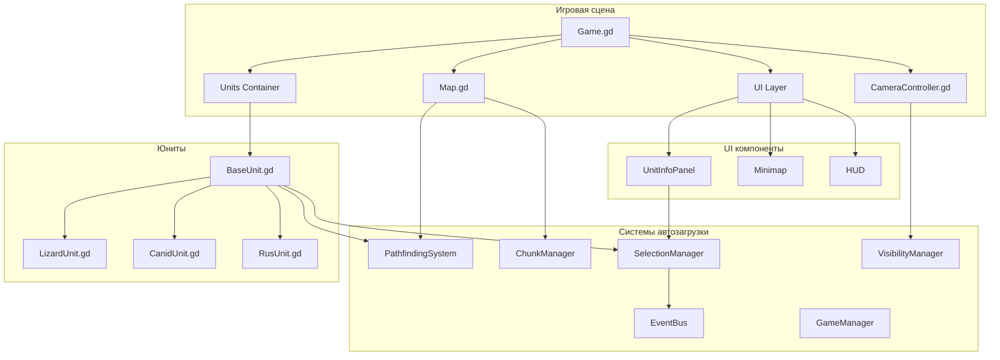
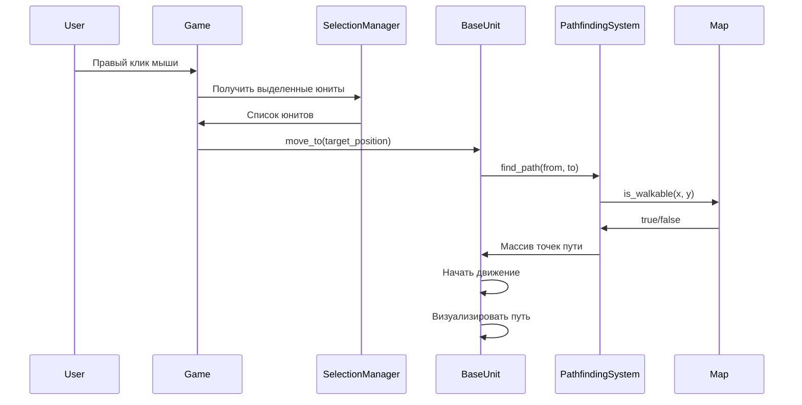
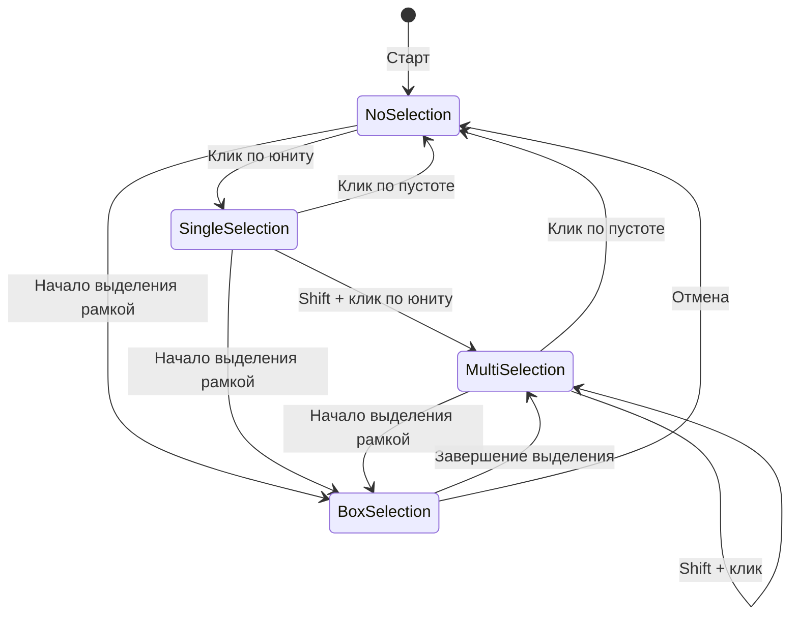
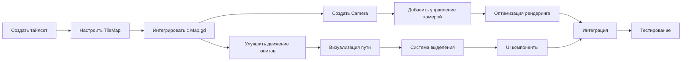

# Фаза 3.1: Краткое резюме и архитектура

**Версия:** 1.0  
**Дата:** 02.12.2024

---

## Краткое резюме

### Что реализуется в Фазе 3.1

Фаза 3.1 "Базовые механики" закладывает фундамент игры, реализуя:

1. **Визуальную карту** с процедурной генерацией и рендерингом
2. **Систему камеры** с полным управлением
3. **Систему юнитов** с движением, выделением и управлением
4. **Базовый UI** для взаимодействия с игрой

### Ключевые компоненты

```
Фаза 3.1
├── Неделя 1-2: Карта и навигация
│   ├── Визуальный рендеринг (TileMap, тайлсет)
│   ├── Система камеры (перемещение, зум)
│   └── Оптимизация (чанки, culling)
│
└── Неделя 3-4: Юниты
    ├── Улучшение движения (визуализация, избегание)
    ├── Система выделения (box selection, индикаторы)
    └── UI (панель информации, health bar, мини-карта)
```

---

## Архитектура системы

### Диаграмма компонентов



### Поток данных при движении юнита



### Система выделения юнитов



---

## Структура файлов

### Новые файлы для создания

```
scenes/
├── systems/
│   ├── CameraController.gd          # Управление камерой
│   └── CameraController.tscn
├── ui/
│   ├── UnitInfoPanel.gd             # Панель информации о юните
│   ├── UnitInfoPanel.tscn
│   ├── Minimap.gd                   # Мини-карта
│   └── Minimap.tscn
└── test/
    ├── TestScene.gd                 # Тестовая сцена
    └── TestScene.tscn

scripts/
└── systems/
    ├── SelectionManager.gd          # Управление выделением
    └── VisibilityManager.gd         # Управление видимостью

assets/
└── tiles/
    ├── terrain_tileset.png          # Тайлсет местности
    └── terrain_tileset.tres         # Ресурс TileSet
```

### Файлы для модификации

```
scenes/
├── world/
│   └── Map.gd                       # Добавить рендеринг TileMap
├── units/
│   └── BaseUnit.gd                  # Добавить визуализацию и выделение
└── game/
    └── Game.gd                      # Интеграция новых систем

scripts/
└── systems/
    ├── PathfindingSystem.gd         # Интеграция с картой
    └── ChunkManager.gd              # Улучшение системы чанков
```

---

## Зависимости между задачами

### Критический путь



### Параллельные задачи

Можно выполнять параллельно:
- **Группа A**: Тайлсет + TileMap + Map.gd
- **Группа B**: Camera + управление камерой
- **Группа C**: Улучшение юнитов + визуализация

После завершения всех групп:
- **Группа D**: Система выделения
- **Группа E**: UI компоненты
- **Группа F**: Интеграция и тестирование

---

## Метрики успеха

### Количественные метрики

| Метрика | Целевое значение | Критическое значение |
|---------|------------------|---------------------|
| FPS (50 юнитов) | 60 | 45 |
| FPS (100 юнитов) | 60 | 30 |
| Время загрузки | < 3 сек | < 5 сек |
| Использование памяти | < 300 MB | < 500 MB |
| Размер билда | < 50 MB | < 100 MB |

### Качественные метрики

- [ ] Управление интуитивно понятно
- [ ] Визуальная обратная связь четкая
- [ ] Нет заметных лагов при взаимодействии
- [ ] UI читаем и информативен
- [ ] Камера движется плавно

---

## Риски и митигация

### Технические риски

| Риск | Вероятность | Влияние | Митигация |
|------|-------------|---------|-----------|
| Проблемы с производительностью TileMap | Средняя | Высокое | Система чанков, LOD |
| Сложность pathfinding с большой картой | Средняя | Среднее | Оптимизация A*, кэширование |
| Баги в системе выделения | Высокая | Низкое | Тщательное тестирование |
| Проблемы с камерой на краях карты | Низкая | Низкое | Ограничения границ |

### Временные риски

| Риск | Вероятность | Влияние | Митигация |
|------|-------------|---------|-----------|
| Недооценка времени на UI | Средняя | Среднее | Упрощенный UI для прототипа |
| Сложности с интеграцией | Средняя | Высокое | Ранняя интеграция, частое тестирование |
| Расширение скоупа | Высокая | Высокое | Строгое следование плану |

---

## Чек-лист готовности к следующей фазе

### Обязательные требования

- [ ] Карта генерируется и отображается
- [ ] Камера полностью функциональна
- [ ] Юниты двигаются и выделяются
- [ ] Базовый UI работает
- [ ] Производительность: 60 FPS с 50 юнитами
- [ ] Нет критических багов

### Желательные требования

- [ ] Мини-карта работает
- [ ] Групповое управление реализовано
- [ ] Горячие клавиши настроены
- [ ] Демо-сцена создана
- [ ] Документация обновлена

### Блокеры для следующей фазы

Следующая фаза (3.2: Базовая экономика) **не может начаться**, пока:
- Карта не отображается визуально
- Юниты не могут двигаться
- Нет системы выделения
- Производительность < 30 FPS

---

## Полезные ссылки

### Документация
- [DEVELOPMENT_ROADMAP.md](./DEVELOPMENT_ROADMAP.md) - Общий план разработки
- [PHASE_3.1_IMPLEMENTATION_GUIDE.md](./PHASE_3.1_IMPLEMENTATION_GUIDE.md) - Детальное руководство (Часть 1)
- [PHASE_3.1_IMPLEMENTATION_GUIDE_PART2.md](./PHASE_3.1_IMPLEMENTATION_GUIDE_PART2.md) - Детальное руководство (Часть 2)
- [TECHNICAL_ARCHITECTURE.md](./TECHNICAL_ARCHITECTURE.md) - Техническая архитектура
- [GDD.md](./GDD.md) - Игровой дизайн документ

### Godot документация
- [TileMap](https://docs.godotengine.org/en/stable/classes/class_tilemap.html)
- [Camera2D](https://docs.godotengine.org/en/stable/classes/class_camera2d.html)
- [AStar2D](https://docs.godotengine.org/en/stable/classes/class_astar2d.html)
- [CharacterBody2D](https://docs.godotengine.org/en/stable/classes/class_characterbody2d.html)

---

## Следующие шаги

1. **Ознакомиться** с детальными руководствами по реализации
2. **Начать с Недели 1-2**: Карта и навигация
3. **Регулярно тестировать** производительность
4. **Обновлять todo list** по мере выполнения задач
5. **Переключиться в режим Code** для начала реализации

---

**Готовы начать? Переключайтесь в режим Code! 💻**